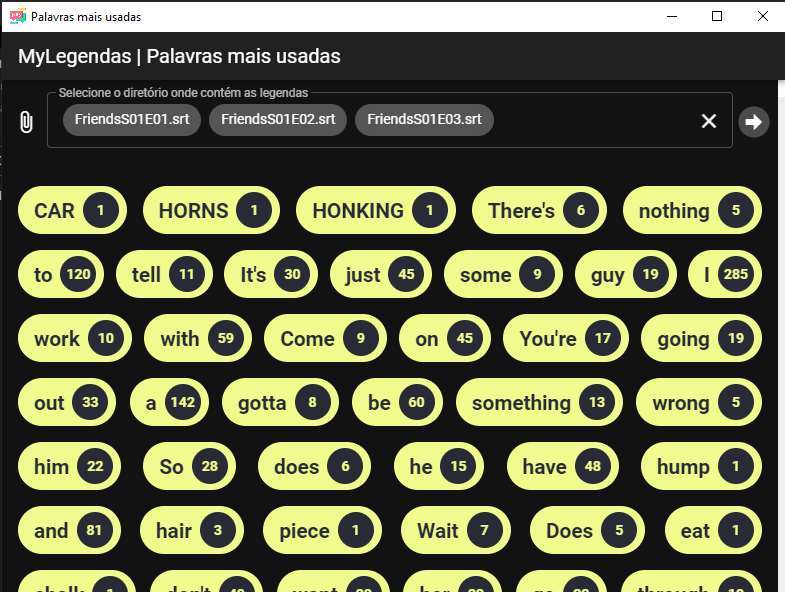

# Palavras mais usadas

## Esta aplicação é um ensaio para usar o RxJS - Programação Reativa

## Descrição

Palavras mais usadas é uma aplicação que ler legendas .srt e reúne as palavras mais utilizadas da mesma. 
A aplicação aplica diversas filtragens até chegar nos dados desejáveis

## Captura de tela

    

## Requisitos 

Deve-se usar pelo menos 5 operadores (filtros ou transformers) do framework ReactiveX.

### Tecnologias utilizadas

* nodejs
* Vuejs
* Vuetify
* Rxjs
* electron

### Como utilizar

No diretório do projeto para instalar os pacotes com os comandos:

> npm install

Após instalado os pacotes inicialize o projeto (modo dev) com

> npm run start